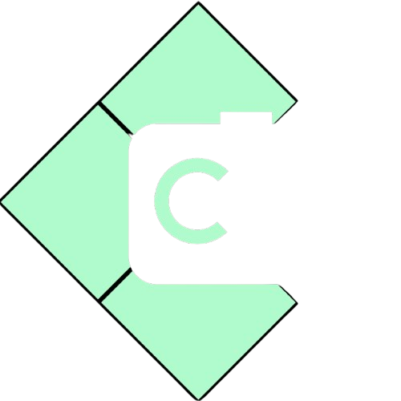

<p align="center">
  
</p>

<h1 align="center">CamCraft</h1>

<p align="center">
  <strong>A playground for photographers to visualize their shots.</strong>
</p>

<p align="center">
  <a href="#features">Features</a> •
  <a href="#demo">Demo</a> •
  <a href="#getting-started">Getting Started</a> •
  <a href="#tech-stack">Tech Stack</a> •
  <a href="#architecture">Architecture</a>
</p>

---

## Inspiration

Every photographer knows the pain:
- **Location scouting** takes hours of travel, only to find the light isn't right
- **Gear decisions** require expensive rentals or purchases before knowing if a camera suits your style  
- **Unpredictable conditions** — you planned for golden hour but got overcast skies
- **Client expectations** — "Can you show me what this would look like?" before the shoot even happens

We built CamCraft as a **photographer's playground** — a virtual environment where you can test any camera, in any location, under any conditions, without leaving your desk. It's pre-visualization for photography: the same way architects render buildings before construction, photographers can now preview shoots before pressing the shutter.

---

## Features

### 1. Explore Cameras in 3D
Browse an interactive showroom of iconic cameras (Sony Handycam, Digital Camera, Fujifilm X-T2, Sony A7IV). Rotate models, view exploded diagrams of internal components, and compare specs.

### 2. Generate Any Location
Search for any place on Earth and configure conditions: time of day, weather, crowd level, even historical era. AI generates a photorealistic 360° panorama you can step into.

### 3. Shoot with Hand Gestures
Use your webcam and natural hand movements to navigate the scene, toggle camera viewfinder overlays, focus on subjects, and capture photos.

### 4. Preview Camera Output
The "focus" feature uses AI to render your current view as if shot with a professional camera (85mm f/1.4 with realistic bokeh), showing what the final photo would actually look like.

### 5. Minecraft-Style Equipment HUD
A fun UI element showing your currently equipped camera body and lens — because photographers think in equipment.

---

## Demo

| Camera Carousel | Exploded View | Panorama Viewer |
|-----------------|---------------|-----------------|
| Browse 3D camera models | See internal components | Immersive 360° experience |

---

## Getting Started

### Prerequisites
- [Bun](https://bun.sh/) (recommended) or Node.js 18+
- Google Gemini API key
- Mapbox API key (for location search)

### Installation

```bash
# Clone the repository
git clone https://github.com/your-username/camcraft.git
cd camcraft

# Install dependencies
bun install

# Configure environment variables
cp .env.example .env.local
```

Add your API keys to `.env.local`:
```env
GEMINI_API_KEY=your_gemini_api_key
NEXT_PUBLIC_MAPBOX_TOKEN=your_mapbox_token
```

### Running Locally

```bash
# Development server
bun dev

# Production build
bun run build
bun start
```

Open [http://localhost:3000](http://localhost:3000) and start testing your next shoot!

---

## Tech Stack

### Languages & Frameworks
| Technology | Purpose |
|------------|---------|
| **TypeScript** | Type-safe development throughout |
| **Next.js 16** | App Router with server components and API routes |
| **React 19** | Latest React with concurrent features |
| **Tailwind CSS 4** | Utility-first styling |

### 3D & Graphics
| Technology | Purpose |
|------------|---------|
| **Three.js** | WebGL-based 3D rendering |
| **React Three Fiber** | Declarative Three.js for React |
| **@react-three/drei** | Useful R3F helpers (Environment, useGLTF, Html) |
| **GSAP** | Professional-grade animations |

### Computer Vision
| Technology | Purpose |
|------------|---------|
| **MediaPipe Tasks Vision** | Real-time hand landmark detection (21 points per hand at 60fps) |

### AI/ML APIs
| Technology | Purpose |
|------------|---------|
| **Google Gemini 3 Pro** | Image generation for panoramas and photo enhancement |
| **Google Veo 3.1** | Video generation for gesture tutorial animations |

### Other Services
| Technology | Purpose |
|------------|---------|
| **Mapbox** | Location search autocomplete |
| **Vercel** | Deployment platform |
| **Bun** | Fast JavaScript runtime and package manager |

---

## Architecture

```
┌─────────────────────────────────────────────────────────────────────┐
│                           CamCraft                                  │
├─────────────────────────────────────────────────────────────────────┤
│                                                                     │
│  ┌─────────────┐    ┌─────────────┐    ┌─────────────┐             │
│  │   Home /    │    │  /generate  │    │    /pano    │             │
│  │  Carousel   │    │  AI Config  │    │   Viewer    │             │
│  └──────┬──────┘    └──────┬──────┘    └──────┬──────┘             │
│         │                  │                  │                     │
│         ▼                  ▼                  ▼                     │
│  ┌─────────────┐    ┌─────────────┐    ┌─────────────┐             │
│  │ React Three │    │   Gemini    │    │  MediaPipe  │             │
│  │   Fiber     │    │   3 Pro     │    │  Hands      │             │
│  │  + GSAP     │    │  (4K Pano)  │    │  (21 pts)   │             │
│  └─────────────┘    └─────────────┘    └──────┬──────┘             │
│                            │                  │                     │
│                            ▼                  ▼                     │
│                     ┌─────────────┐    ┌─────────────┐             │
│                     │  Three.js   │◄───│  Gesture    │             │
│                     │  Panorama   │    │  Engine     │             │
│                     └──────┬──────┘    └─────────────┘             │
│                            │                                        │
│                            ▼                                        │
│                     ┌─────────────┐                                 │
│                     │   Gemini    │                                 │
│                     │  (Focus AI) │                                 │
│                     └─────────────┘                                 │
│                                                                     │
└─────────────────────────────────────────────────────────────────────┘
```

### Project Structure

```
src/
├── app/
│   ├── page.tsx           # Landing page
│   ├── create/            # Camera carousel
│   ├── generate/          # Panorama configuration
│   ├── pano/              # 360° viewer with hand gestures
│   ├── gallery/           # Captured photos gallery
│   └── api/
│       ├── generate-pano/ # Gemini panorama generation
│       ├── focus-image/   # AI photo enhancement
│       └── gallery/       # Gallery file management
├── components/
│   ├── CameraCarousel.tsx # 3D camera showroom
│   ├── PanoViewer.tsx     # Three.js panorama renderer
│   ├── HandOverlay.tsx    # MediaPipe hand tracking
│   ├── GestureTutorial.tsx# Gesture onboarding
│   └── CameraEquipmentHUD.tsx # Minecraft-style equipment UI
└── lib/
    └── galleryStore.ts    # LocalStorage gallery management
```

---

## Generative AI Implementation

Generative AI is central to CamCraft. We integrated multiple Google AI models to solve real photographer problems:

### 1. Gemini 3 Pro — Virtual Location Scouting

**Problem**: Location scouting requires travel, and you can't control conditions when you arrive.

**Solution**: Generate photorealistic 360° panoramas from text descriptions. Photographers specify location + conditions, and Gemini creates an immersive preview.

```typescript
const prompt = `Create an equirectangular image with perfect seam connection...
Location: ${location}. Time: ${timeOfDay}. Weather: ${weather}...`;

const response = await fetch("gemini-3-pro-image-preview:generateContent", {
  body: JSON.stringify({
    contents: [{ parts: [{ text: prompt }] }],
    generationConfig: { 
      responseModalities: ["IMAGE"], 
      imageConfig: { imageSize: "4K" } 
    }
  })
});
```

**Use case**: A wedding photographer can preview a venue at golden hour *and* overcast conditions before recommending a backup plan to clients.

### 2. Gemini 3 Pro — Simulated Camera Output

**Problem**: Photographers want to know "what would this shot look like with my camera?" without taking the actual photo.

**Solution**: When users "focus" on a scene, we send the viewport to Gemini with instructions to render it as if shot with a Sony A7IV at 85mm f/1.4 — complete with shallow depth of field, realistic bokeh, and crisp detail.

**Use case**: Test how a portrait lens would render background blur at a specific location before committing to gear rental.

### 3. Veo 3.1 — Gesture Tutorials

**Problem**: Hand gesture controls are unintuitive without demonstration.

**Solution**: AI-generated video loops showing mannequin hands performing each gesture.

**Use case**: Onboarding — users see exactly how to pinch, frame, and focus before entering the viewer.


---

## Commands

```bash
bun dev          # Start development server (http://localhost:3000)
bun run build    # Build for production
bun run lint     # Run ESLint
bun start        # Start production server
```

---

## License

MIT

---

<p align="center">
  Built with cameras, code, and a lot of hand gestures.
</p>
